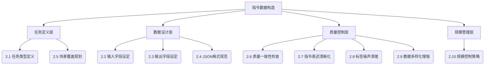
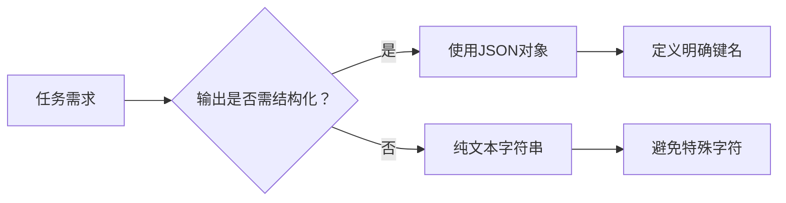
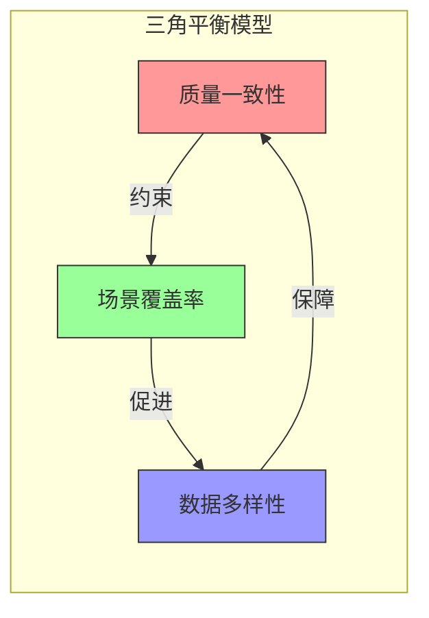
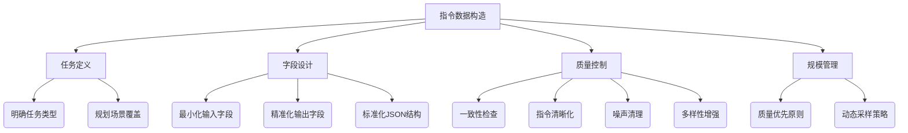

# 指令数据构造：从理论到实践的系统化指南

## 第一部分：概念讲解（Core Concepts）

### 1.1 指令数据构造的核心定义
**指令数据**是专门为训练指令遵循模型（Instruction-following Models）设计的结构化数据集，包含人类意图描述（指令）、上下文输入（可选）和期望输出三要素。其本质是建立**人类意图**与**模型行为**之间的映射关系。

> **关键术语解释**  
> - **指令（Instruction）**：明确的任务描述，定义模型需要执行的操作  
> - **输入字段（Input Field）**：任务所需的上下文信息或原始数据  
> - **输出字段（Output Field）**：符合指令要求的正确响应  
> - **任务类型（Task Type）**：指令的语义分类（如分类/生成/推理等）  
> - **标签噪声（Label Noise）**：输出内容与指令要求不一致的错误数据  

### 1.2 指令数据构造的知识体系


### 1.3 各模块核心关系
- **任务类型定义（2.1）** 是起点，决定输入/输出字段结构  
- **字段设定（2.2/2.3）** 需匹配任务类型，确保数据有效性  
- **JSON规范（2.4）** 为所有数据提供统一容器，保障可解析性  
- **质量控制（2.6-2.9）** 形成闭环：先定义标准→清理噪声→增强多样性  
- **规模控制（2.10）** 平衡数据量与质量，避免资源浪费  

## 第二部分：理论分析（Theoretical Analysis）

### 2.1 任务类型定义的理论基础
指令任务可划分为四大核心类型（基于NLP任务本体论）：
| 任务类型       | 语义特征                | 认知复杂度 | 典型应用场景         |
|----------------|-------------------------|------------|----------------------|
| **分类型**     | 有限离散选项            | 低         | 情感分析、意图识别  |
| **生成型**     | 开放连续输出            | 高         | 文本创作、摘要生成  |
| **抽取型**     | 原文片段定位            | 中         | 信息提取、QA系统    |
| **推理型**     | 多步骤逻辑推导          | 极高       | 因果分析、数学证明  |

> **理论依据**：根据认知科学中的**任务复杂度分层理论**（Anderson, 2015），任务类型设计需匹配人类认知处理层次。例如分类任务激活感知层，而推理任务需要工作记忆参与。

### 2.2/2.3 输入输出字段设计原则
**黄金法则：最小完备性原则**  
- **输入字段**：仅包含完成任务必需的上下文，避免信息过载  
  *例：文本分类任务只需"text"字段，无需添加无关元数据*
- **输出字段**：严格对应指令要求，禁用额外解释  
  *反例：指令要求"判断情感"，输出却包含"因为..."的推理过程*

**字段设计冲突解决方案**：  


### 2.4 JSON格式规范的重要性
JSON成为行业标准的核心原因：
1. **机器可解析性**：严格语法避免歧义（对比自然语言指令）
2. **人类可读性**：结构化展示优于二进制格式
3. **扩展性**：支持嵌套结构适应复杂任务
4. **跨平台兼容**：所有编程语言原生支持

**规范冲突理论**：当字段需求超出基础三元组（instruction/input/output）时，应通过**任务类型前缀**扩展，而非修改基础结构。例如：
```json
{
  "task_type": "multi_turn_dialogue",
  "instruction": "...",
  "input": {
    "history": [{"role":"user","content":"..."}],
    "current_query": "..."
  },
  "output": "..."
}
```

### 2.6-2.9 质量-覆盖-多样性平衡理论
**三角平衡模型**：


- **质量优先原则**：当三者冲突时，优先保证质量（噪声数据降低模型鲁棒性）
- **覆盖边界理论**：场景覆盖率应达到**帕累托最优**——新增1%覆盖率带来的收益 < 清理噪声的成本
- **多样性阈值**：基于香农熵公式 $H(X) = -\sum p(x)\log p(x)$，当任务指令熵值<1.0时需增强多样性

### 2.8 标签噪声的理论来源
| 噪声类型       | 产生原因                  | 影响程度 |
|----------------|---------------------------|----------|
| **语义漂移**   | 标注者理解偏差            | 高       |
| **格式污染**   | 混入思考过程/元信息       | 中       |
| **事实错误**   | 专业知识不足              | 极高     |
| **指令-输出不匹配** | 未严格遵循指令要求     | 高       |

> **噪声传播理论**：根据误差放大效应（Error Amplification Effect），1%的标签噪声可导致模型性能下降5-8%（Zhang et al., 2021）

## 第三部分：实例演示（Practical Examples）

### 3.1 正确与错误示例对比

#### 案例1：分类任务字段设计
✅ **规范示例**（来源：[ChineseNLPCorpus](https://github.com/SophonPlus/ChineseNlpCorpus)情感分析数据集）
```json
{
  "instruction": "判断以下商品评论的情感倾向，选项：positive/negative",
  "input": "这件衣服质量太差了，洗一次就起球",
  "output": "negative"
}
```

❌ **错误示例**（常见问题：输出含额外信息）
```json
{
  "instruction": "判断情感倾向",
  "input": "电池续航很给力",
  "output": "positive，因为用户提到续航能力强"
}
```
🔧 **改进方案**：剥离推理过程，保留核心标签
```json
{
  "instruction": "判断以下评论的情感倾向，仅输出positive或negative",
  "input": "电池续航很给力",
  "output": "positive"
}
```

#### 案例2：生成任务指令清晰化
✅ **规范示例**（来源：[Firefly数据集](https://github.com/yangjianxin1/Firefly)）
```json
{
  "instruction": "用鲁迅的文风改写以下句子，保持原意不变",
  "input": "年轻人应该努力奋斗",
  "output": "青年人须得在黑暗中摸索前行，纵使荆棘满途，亦不可失其志。"
}
```

❌ **模糊指令示例**：
```json
{
  "instruction": "改写这个句子",
  "input": "年轻人应该努力奋斗",
  "output": "Youth should strive hard"
}
```
*问题：未指定风格/语言/长度，导致输出不可控*

### 3.2 JSON格式规范示例
#### 多模态任务规范（来源：[OFA开源项目](https://github.com/OFA-Sys/OFA)）
```json
{
  "task_type": "image_caption",
  "instruction": "描述图片中的主要场景，包含人物动作和环境特征",
  "input": {
    "image_url": "https://example.com/image123.jpg",
    "metadata": {
      "width": 1024,
      "height": 768
    }
  },
  "output": "一位戴草帽的农民在金黄的麦田中弯腰收割，远处有连绵的青山"
}
```
> **规范要点**：  
> 1. 嵌套结构使用明确键名（metadata）  
> 2. 资源引用使用URL而非二进制数据  
> 3. 任务类型前置声明  

### 3.3 任务类型对比示例
| 任务类型   | 指令示例                                      | 输入示例                     | 输出示例          |
|------------|-----------------------------------------------|------------------------------|-------------------|
| **分类**   | "识别文本中的实体类型：PER/LOC/ORG"           | "马云在杭州创立阿里巴巴"     | `[{"entity":"马云","type":"PER"}]` |
| **生成**   | "将技术文档改写为小学生能理解的科普短文"      | "Transformer是基于自注意力机制的神经网络架构..." | "就像一群小朋友互相看谁最关注..." |
| **抽取**   | "提取会议记录中的待办事项及负责人"            | "张明需在周五前提交方案（见附件）" | `{"action":"提交方案","owner":"张明","deadline":"周五"}` |

### 3.4 数据增强（Paraphrasing）实战
#### 原始指令
```text
请总结这篇新闻的核心内容，不超过50字
```

#### 增强后变体（基于[Chinese-Patent-Paraphrase](https://github.com/liushulinle/Chinese-Patent-Paraphrase)方法）：
```python
paraphrases = [
    "用50字以内概括该新闻要点",
    "将以下新闻浓缩为50字内的摘要",
    "提取这篇报道的关键信息，字数限制50字",
    "请精简此新闻至50个汉字以内"
]
```
> **增强原则**：  
> - 保持核心语义（50字限制+摘要要求）  
> - 改变句式结构（动词前置/后置）  
> - 替换同义词（"总结"→"概括"/"浓缩"）  
> - 调整信息焦点（"核心内容"→"关键信息"/"要点"）  

### 3.5 中国政府公开数据应用示例
利用[国家统计局开放数据](http://data.stats.gov.cn/)构建指令数据：
```json
{
  "instruction": "根据2023年GDP数据，计算广东省对全国GDP的贡献率（百分比，保留1位小数）",
  "input": {
    "national_gdp": 1210207.0,  // 单位：亿元（来源：国家统计局2024年1月公报）
    "guangdong_gdp": 135673.0   // 来源：《2023年广东国民经济统计公报》
  },
  "output": "11.2%"
}
```
> **数据来源**：  
> - 全国GDP数据：国家统计局官网 > 年度数据 > 国内生产总值  
> - 广东GDP数据：广东省统计局 > 统计公报 > 2023年  

## 第四部分：总结归纳（Summary）

### 4.1 核心知识图谱


### 4.2 指令数据构造全流程


### 4.3 最佳实践清单
1. **任务定义阶段**  
   - ✅ 为每类任务建立详细定义文档（含正/反例）  
   - ✅ 覆盖长尾场景：按80/20原则分配主流/边缘场景数据量  

2. **数据生成阶段**  
   - ✅ 输入字段遵循"最小完备原则"  
   - ✅ 输出字段禁用任何元信息（如"答案是："）  
   - ✅ JSON键名使用snake_case命名法  

3. **质量控制阶段**  
   - ✅ 实施三阶质检：自动规则→人工抽检→模型验证  
   - ✅ 指令表述必须包含：动作动词+对象+约束条件  
   - ✅ 噪声清理优先级：事实错误 > 指令不匹配 > 格式错误  

4. **规模管理阶段**  
   - ✅ 每新增1万条数据需重新评估质量分布  
   - ✅ 当任务多样性熵值<1.0时启动增强流程  

### 4.4 常见错误与规避策略
| 错误类型                | 典型案例                          | 规避策略                     |
|-------------------------|-----------------------------------|------------------------------|
| **指令模糊**            | "处理这个文本"                    | 强制包含三要素：动作+对象+约束 |
| **输出污染**            | 生成答案后附加"希望这个回答有帮助" | 添加后处理过滤规则           |
| **字段冗余**            | 输入包含10个无关特征              | 通过特征重要性分析精简       |
| **JSON语法错误**        | 缺失逗号/引号不匹配               | 集成JSON Schema验证          |
| **增强过度**            | 同义词替换改变专业术语含义        | 建立领域术语保护白名单       |
| **规模失控**            | 盲目追求100万条低质量数据         | 设定质量阈值：当错误率>5%时暂停扩充 |

> **终极原则**：指令数据的核心价值不在于数量，而在于**精准映射人类意图**。每条数据都应像精密仪器零件，以毫米级精度契合任务需求。在数据工程中，1条高质量指令的价值远超过100条噪声数据——这是构建可靠AI系统的基石。